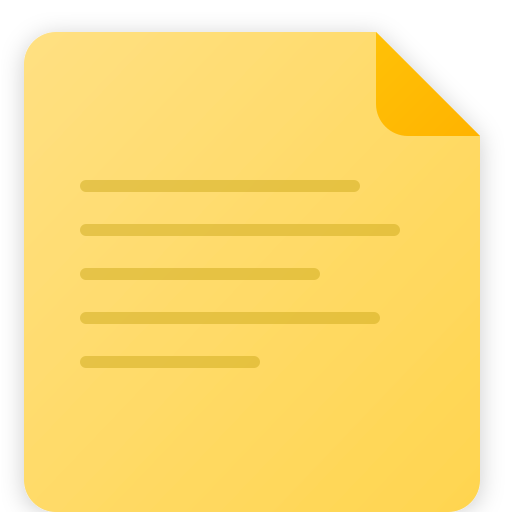

<p align="center">
  
</p>

<h1 align="center">Sticky Notes</h1>

<p align="center">
  A local, open-source alternative to Windows 11 Sticky Notes with a rich text editor and inline images.
</p>

<p align="center">
  <a href="https://github.com/FelipeGazapina/sticky-notes/releases/latest">
    
  </a>
  <a href="https://github.com/FelipeGazapina/sticky-notes/releases/latest">
    
  </a>
  <a href="https://github.com/FelipeGazapina/sticky-notes/blob/main/LICENSE">
    
  </a>
</p>

---

## Why does this app exist?

Windows 11 **Sticky Notes** has limitations that get in the way of daily use:

- **Images are pinned to the top of the note**, never inline with text. You can't paste an image in the middle of a paragraph.
- **Requires a Microsoft account and cloud sync**, which adds latency to open and create notes.
- **Not extensible** — if you want a new feature, you have to wait for Microsoft to implement it.

**Sticky Notes** fixes all of that:

- **Inline images** — paste with `Ctrl+V` or drag and drop an image right into your text. It appears exactly where you placed it.
- **100% local** — no account, no cloud, no latency. Opens instantly, creates notes in milliseconds.
- **Open-source and extensible** — built with Electron + Quill.js, easy to customize and add new features.

---

## Download and Installation

### Download the executable

Go to the releases page on GitHub:

**[github.com/FelipeGazapina/sticky-notes/releases](https://github.com/FelipeGazapina/sticky-notes/releases/latest)**

Choose one of the options:

| File | What is it |
|---|---|
| `Sticky Notes Setup X.X.X.exe` | **Installer** — installs on your computer with desktop and start menu shortcuts |
| `Sticky Notes Portable X.X.X.exe` | **Portable** — runs directly, no installation needed. Great for USB drives |

> **Note:** Windows may show a "Windows protected your PC" warning because the executable is not digitally signed. Click **"More info"** and then **"Run anyway"**.

### Install via Setup

1. Download `Sticky Notes Setup X.X.X.exe`
2. Run the installer
3. Choose the installation directory (or leave the default)
4. Done — the app appears on your desktop and in the start menu

### Use the portable version

1. Download `Sticky Notes Portable X.X.X.exe`
2. Run it directly — no installation required
3. Data is saved locally in the user folder

---

## Features

### Rich text editor with Quill.js

- **Bold**, *italic*, <u>underline</u>, ~~strikethrough~~
- Bullet lists
- Keyboard shortcuts: `Ctrl+B`, `Ctrl+I`, `Ctrl+U`

### Inline images

- **Paste images** with `Ctrl+V` — the image appears exactly at the cursor position
- **Drag and drop** images directly into the note
- Images are saved inside the note itself, no external file dependencies

### 7 note colors

Yellow, green, pink, purple, blue, charcoal, and white — just like the original Windows Sticky Notes.

### Light and dark theme

Automatically detects the system theme or allows manual toggle.

### Pin to top

Any note can be pinned above all other windows with the pin button.

### Everything is local

- No Microsoft account, no login, no internet
- Data saved locally via `electron-store`
- Zero latency to open, create, or edit notes

---

## For developers

If you want to run the project from source, add features, or contribute:

### Prerequisites

- [Node.js](https://nodejs.org/) v18 or higher
- [Git](https://git-scm.com/)

### Clone and run

```bash
git clone https://github.com/FelipeGazapina/sticky-notes.git
cd sticky-notes
npm install
npm start
```

### Available scripts

| Command | What it does |
|---|---|
| `npm start` | Opens the app in normal mode |
| `npm run dev` | Opens the app in development mode |
| `npm run build` | Generates the installer + portable in the `dist/` folder |
| `npm run build:portable` | Generates only the portable executable |

### Project structure

```
sticky-notes/
├── main.js                      # Electron main process
├── preload/
│   ├── noteListPreload.js       # API bridge for the note list
│   └── notePreload.js           # API bridge for each note
├── src/
│   ├── main/
│   │   ├── store.js             # Local persistence (electron-store)
│   │   ├── windowManager.js     # Window management
│   │   ├── ipcHandlers.js       # Inter-process communication
│   │   └── menuBuilder.js       # App menu
│   └── renderer/
│       ├── note/                # Individual note UI
│       ├── noteList/            # Note list UI
│       └── shared/              # Shared themes and styles
└── assets/
    └── icons/                   # App icons
```

### Tech stack

- **Electron** — cross-platform desktop framework
- **Quill.js v2** — rich text editor
- **electron-store** — local JSON persistence
- **Vanilla JS** — no frontend frameworks, lightweight and fast
- **electron-builder** — Windows packaging

---

## Roadmap

Features planned for future releases:

- [ ] Table support in the editor
- [ ] Export notes as PDF or Markdown
- [ ] Note backup and restore
- [ ] Global shortcuts for quick note creation
- [ ] Global search across all notes

---

## Contributing

Contributions are welcome! Open an [issue](https://github.com/FelipeGazapina/sticky-notes/issues) to report bugs or suggest features, or submit a pull request.

---

## License

This project is open-source. See the [LICENSE](LICENSE) file for details.
